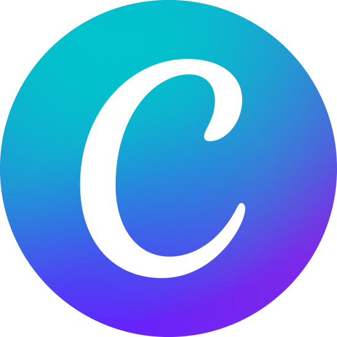

>Hi, I'm **Isael Jafeth Requena Romero**, a Venezuelan passionate about learning technology and programming.
>
>*Every day improving, I never stop learning in this life.* ☄

>**I use:**
>
><code></code>
<code></code>
<code></code>
<code></code>
<code></code>
<code></code>
<code></code>
<code></code>

> - 🌱 I’m currently learning: Frontend development 🖥
> - ⚡ Fun fact: Love videogames 🎮👾 | Learning English 📚 | Graphic design 🖋
> - 👯 I’m looking to collaborate on: Web development 💻 | Mobile app 📱

>## 📫 You can reach me on:
>
>   - 🪐   **[Facebook](https://www.facebook.com/IsaelRomeQuena/)**
>   - 🪐  **[Instagram](https://www.instagram.com/isael_jafeth/)
>   - 🪐   **[Youtube](https://www.youtube.com/channel/UCkpRDjeycqwONr3peMyfXvw)**
>   - 🪐  **[Gmail](https://mail.google.com/mail/u/0/?tab=rm&ogbl#inbox?compose=GTvVlcSBnNgtbnGfHwTsVSsvKLkFVxftGkWWRMxbrkmwDtTqTsbnWTXZrQZlmQrnNvLkCtDDQGcpn)**
