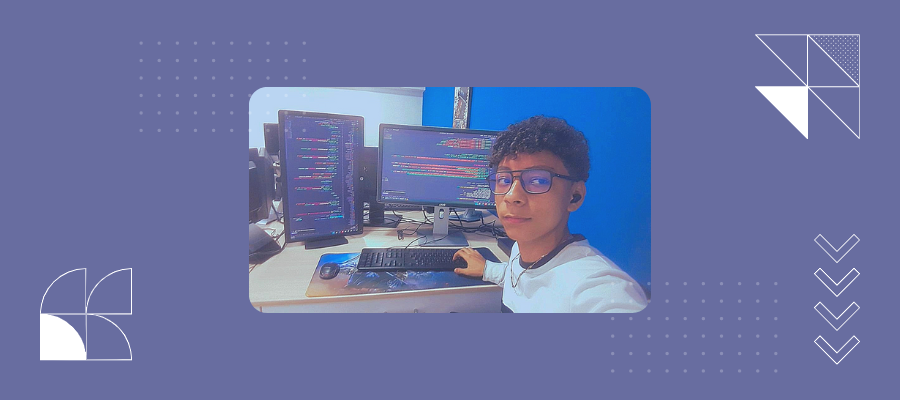

# 🚀 Hi there, I'm Isael Jafeth Requena Romero! 

<!-- <div align="center">
  
</div> -->

<div align="center">
  
</div>

---

## 🎯 About Me

> **Venezuelan developer passionate about technology and programming**  
> *"Every day improving, I never stop learning in this life"* ☄️

🔥 **Currently working at:** Fibex Telecom as Full Stack Developer

🌱 **Learning:** Advanced Full Stack, AI Development and new technologies  

🎮 **Fun fact:** Gaming lover | Learning English | AI developer

🤝 **Looking to collaborate on:** Web development | Mobile apps | Game development  

<div align="center">
  
</div>

---

## 🛠️ Tech Stack

### Frontend
<div align="center">
  
</div>

### Backend & Databases
<div align="center">
  
</div>

### Mobile & TV Development
<div align="center">
  
  
  
</div>

### Tools & Others
<div align="center">
  
  
</div>

---

## 📊 GitHub Statistics

<div align="center">
  
  
</div>

<div align="center">
  
</div>

<div align="center">
  
</div>


## 🌟 Professional Experience

### 👨‍💻 Fibex Telecom
**Full Stack Developer and Tester** | *Present*
- Development of web and mobile applications
- Roku/TV streaming application development
- AI project
- Database management

<div align="center">
  
</div>

---

## 🎯 Technical Skills

<div align="center">
  


</div>

---

## 🌈 Productivity Metrics

<div align="center">
  
</div>

<div align="center">
  
  
</div>

---

## 🎮 When I'm Not Coding...

<div align="center">
  
  
  
</div>

- 🎮 **Gaming:** Exploring virtual worlds and new adventures
- 📚 **Learning English:** Improving my linguistic skills
- 🎨 **Graphic Design:** Creating impactful visual content
- 🌟 **Innovation:** Always looking for the next big idea

---

## 🌐 Connect With Me

<div align="center">
  
[](mailto:isaeljafeth08@gmail.com)
[](https://www.facebook.com/IsaelRomeQuena/)
[](https://www.youtube.com/channel/UCkpRDjeycqwONr3peMyfXvw)
[](https://www.instagram.com/jafeth_isael/)

</div>

---

## 💡 Development Philosophy

<div align="center">
  
</div>

```javascript
const isael = {
  code: ["JavaScript", "TypeScript", "PHP", "BrightScript", "HTML", "CSS", "Sass", "C++", "Python"],
  frameworks: ["React", "Angular", "Ionic", "Node.js", "Laravel"],
  databases: ["MySQL", "PostgreSQL", "MongoDB", "Firebase"],
  tools: ["VS Code", "Git", "DBeaver", "Android Studio", "Figma", "Open AI"],
  platforms: ["Web", "Mobile", "Roku/TV"],
  currentFocus: "Full Stack Development",
  funFact: "I debug with console.log and I'm not ashamed! 😄"
};
```

> *"The only way to do great work is to love what you do. If you haven't found it yet, keep looking. Don't settle."* - Steve Jobs

<div align="center">
  
</div>

---

## 🎨 Rick and Morty Universe

<div align="center">
  
  
</div>

> *"Wubba Lubba Dub Dub!"* - Rick Sanchez

> Like Rick, I'm always experimenting with new technologies and dimensions of code 🚀

> Always grateful to God, family and my boss who inspire me

---

## 🏆 Featured Achievements

🎖️ **Full Stack Developer** at Fibex Telecom  

🎖️ **Over 100 commits** on GitHub this year  

🎖️ **Roku Developer** with published channels

🎖️ **Mobile App Developer** with published apps  

---

## 🌟 Inspirational Quote

<div align="center">
  
  
  ***"The best way to predict the future is to invent it."*** - Alan Kay
</div>

---

<div align="center">
  
</div>

<div align="center">
  
  
</div>

---

<div align="center">
  <h3>⭐ If you like what I do, don't forget to star my repositories! ⭐</h3>
  
</div>
